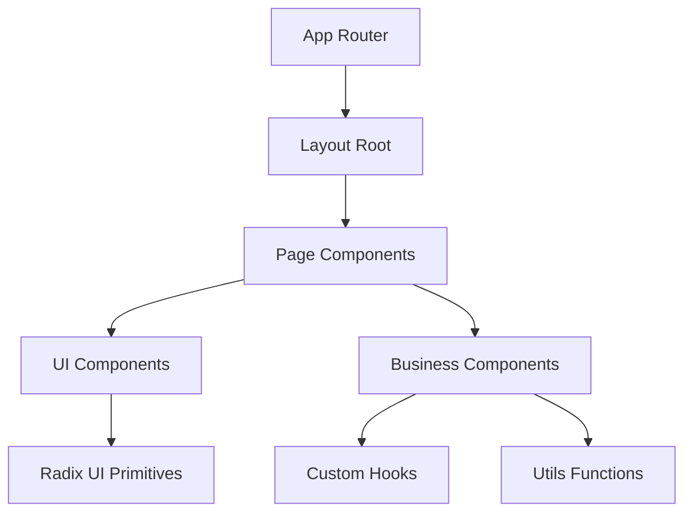

# 🍽️ Buffet Pierroti Eventos - Site Institucional

> **Site institucional moderno para empresa de buffet com design elegante e funcionalidades completas**

[](https://nextjs.org/)
[](https://reactjs.org/)
[](https://www.typescriptlang.org/)
[](https://tailwindcss.com/)

---

## 📋 Informações do Projeto

> **Responsável:** Luiz Carlos Vitoriano Neto — Front-End Developer  
> **Versão:** 0.1.0

## 📘 Visão Geral

O **Buffet Pierroti Eventos** é um site desenvolvido como **MVP (Produto Mínimo Viável)**, com foco em **simplicidade, performance e experiência do usuário**.
O objetivo é apresentar os serviços do buffet, permitir contato rápido via WhatsApp e criar base para evolução futura com painel administrativo e armazenamento de dados.

## 👨‍💻 Desenvolvedor Responsável

**Luiz Carlos Vitoriano Neto**  
Front-End Developer

[🌐 GitHub](https://github.com/LuisCarlos01)  
[💼 LinkedIn](https://www.linkedin.com/in/luis-carlos-vitoriano-neto-56a58321b/)

---

## 📋 Índice

- [🎯 Sobre o Projeto](#-sobre-o-projeto)
- [🛠️ Stack Tecnológico](#️-stack-tecnológico)
- [🏗️ Arquitetura](#️-arquitetura)
- [🚀 Instalação](#-instalação)
- [📱 Funcionalidades](#-funcionalidades)
- [🎨 Design System](#-design-system)
- [📁 Estrutura de Pastas](#-estrutura-de-pastas)
- [🔧 Scripts Disponíveis](#-scripts-disponíveis)
- [📊 Performance](#-performance)
- [🤝 Contribuição](#-contribuição)
- [📄 Licença](#-licença)

## 🎯 Sobre o Projeto

O **Buffet Pierroti Eventos** é um site institucional moderno desenvolvido como MVP para apresentar os serviços de buffet da empresa. O projeto foi criado com foco em simplicidade, performance e experiência do usuário, oferecendo uma plataforma elegante para clientes que desejam contratar serviços de catering para eventos.

### ✨ Características Principais

- 🎨 **Design Moderno**: Interface elegante e profissional
- 📱 **Totalmente Responsivo**: Adaptado para todos os dispositivos
- ⚡ **Performance Otimizada**: Carregamento rápido e eficiente
- ♿ **Acessibilidade**: Componentes acessíveis com Radix UI
- 🔍 **SEO Friendly**: Estrutura otimizada para motores de busca
- 📝 **Formulários Inteligentes**: Captura de leads com validação
- 🚀 **MVP Focado**: Desenvolvido como produto mínimo viável
- 📞 **Contato WhatsApp**: Integração direta para comunicação rápida
- 🔄 **Base Evolutiva**: Arquitetura preparada para futuras expansões

## 🛠️ Stack Tecnológico

### 🎯 Core Framework
- **[Next.js 15.2.4](https://nextjs.org/)** - Framework React com App Router
- **[React 19](https://reactjs.org/)** - Biblioteca de interface de usuário
- **[TypeScript 5](https://www.typescriptlang.org/)** - Tipagem estática
- **[Tailwind CSS 4.1.9](https://tailwindcss.com/)** - Framework CSS utilitário

### 🧩 Componentes e UI
- **[Radix UI](https://www.radix-ui.com/)** - Componentes acessíveis
- **[shadcn/ui](https://ui.shadcn.com/)** - Sistema de design moderno
- **[Lucide React](https://lucide.dev/)** - Biblioteca de ícones
- **[Sonner](https://sonner.emilkowal.ski/)** - Notificações toast

### 📝 Formulários e Validação
- **[React Hook Form](https://react-hook-form.com/)** - Gerenciamento de formulários
- **[Zod](https://zod.dev/)** - Validação de esquemas
- **[Hookform Resolvers](https://github.com/react-hook-form/resolvers)** - Resolvers de validação

### 📊 Analytics e Performance
- **[Vercel Analytics](https://vercel.com/analytics)** - Analytics de performance
- **[Embla Carousel](https://www.embla-carousel.com/)** - Componente de carrossel
- **[Recharts](https://recharts.org/)** - Biblioteca de gráficos

## 🏗️ Arquitetura

### 🎯 Padrões Arquiteturais

- **App Router**: Roteamento moderno do Next.js 15
- **Server Components**: Renderização no servidor para melhor performance
- **Component Composition**: Componentes reutilizáveis e modulares
- **Atomic Design**: Estrutura hierárquica de componentes
- **Design System**: Sistema consistente de design com shadcn/ui

### 🔄 Fluxo de Dados



## 🚀 Instalação

### 📋 Pré-requisitos

- **Node.js** 18.17 ou superior
- **pnpm** (recomendado) ou npm/yarn
- **Git** para controle de versão

### 🔧 Passos de Instalação

1. **Clone o repositório**
   ```bash
   git clone https://github.com/LuisCarlos01/buffet-pierroti-eventos.git
   cd buffet-pierroti-eventos
   ```

2. **Instale as dependências**
   ```bash
   pnpm install
   # ou
   npm install
   ```

3. **Configure as variáveis de ambiente**
   ```bash
   cp .env.example .env.local
   # Edite o arquivo .env.local com suas configurações
   ```

4. **Execute o projeto em desenvolvimento**
   ```bash
   pnpm dev
   # ou
   npm run dev
   ```

5. **Acesse o projeto**
   ```
   http://localhost:3000
   ```

## 📱 Funcionalidades

### 🎯 Seções Principais

- **🏠 Hero Section**: Apresentação principal com formulário de contato
- **📋 Como Funciona**: Explicação do processo de contratação
- **🔄 Process Steps**: Etapas detalhadas do serviço
- **⭐ Diferenciais**: Pontos fortes da empresa
- **💬 Depoimentos**: Avaliações de clientes
- **🖼️ Galeria**: Portfólio de eventos realizados
- **❓ FAQ**: Perguntas frequentes
- **📝 Contato**: Formulário completo de solicitação
- **🦶 Footer**: Informações da empresa e links

### 🎨 Componentes Interativos

- **Formulários Inteligentes**: Validação em tempo real
- **Galeria Responsiva**: Grid adaptativo com hover effects
- **FAQ Accordion**: Interface expansível
- **Navegação Suave**: Scroll suave entre seções
- **Modo Escuro**: Suporte a tema escuro (preparado)

## 🎨 Design System

### 🎨 Paleta de Cores

```css
/* Cores Principais */
--primary: oklch(0.25 0.03 60);      /* Marrom elegante */
--accent: oklch(0.65 0.18 45);       /* Laranja vibrante */
--background: oklch(0.98 0.01 85);   /* Fundo claro */
--foreground: oklch(0.15 0.02 60);   /* Texto escuro */

/* Cores de Suporte */
--muted: oklch(0.95 0.01 85);        /* Texto suave */
--border: oklch(0.9 0.01 85);        /* Bordas */
--card: oklch(1 0 0);                /* Cards */
```

### 📏 Sistema de Espaçamento

- **Padding**: `p-4`, `p-6`, `p-8`, `py-20`
- **Margin**: `m-4`, `m-6`, `m-8`, `mb-16`
- **Gap**: `gap-4`, `gap-6`, `gap-8`, `gap-12`

### 🔤 Tipografia

- **Fonte Principal**: Geist (Sans-serif)
- **Fonte Monospace**: Geist Mono
- **Tamanhos**: `text-sm`, `text-lg`, `text-xl`, `text-4xl`, `text-6xl`

## 📁 Estrutura de Pastas

```
📁 buffet-show/
├── 📁 app/                          # 🎯 Next.js App Router
│   ├── 📄 layout.tsx               # 🏠 Layout raiz
│   ├── 📄 page.tsx                 # 🏠 Página inicial
│   └── 📄 globals.css              # 🎨 Estilos globais
│
├── 📁 components/                   # 🧩 Componentes React
│   ├── 📄 hero-section.tsx         # 🎯 Seção hero
│   ├── 📄 how-it-works.tsx         # 📋 Como funciona
│   ├── 📄 process-steps.tsx        # 🔄 Etapas do processo
│   ├── 📄 differentials.tsx        # ⭐ Diferenciais
│   ├── 📄 testimonials.tsx         # 💬 Depoimentos
│   ├── 📄 gallery.tsx              # 🖼️ Galeria
│   ├── 📄 faq.tsx                  # ❓ FAQ
│   ├── 📄 contact-form.tsx         # 📝 Formulário contato
│   ├── 📄 footer.tsx               # 🦶 Rodapé
│   ├── 📄 theme-provider.tsx       # 🎨 Provedor de tema
│   └── 📁 ui/                      # 🧩 Componentes UI
│       ├── 📄 button.tsx           # 🔘 Botão
│       ├── 📄 input.tsx            # 📝 Input
│       ├── 📄 card.tsx              # 🃏 Card
│       ├── 📄 dialog.tsx           # 💬 Dialog
│       ├── 📄 accordion.tsx        # 📋 Accordion
│       └── ... (40+ componentes)   # 🎨 Kit completo UI
│
├── 📁 hooks/                        # 🎣 Hooks customizados
│   ├── 📄 use-mobile.ts            # 📱 Detecção mobile
│   └── 📄 use-toast.ts             # 🔔 Hook toast
│
├── 📁 lib/                          # 📚 Utilitários
│   └── 📄 utils.ts                 # 🛠️ Funções utilitárias
│
├── 📁 public/                       # 🌐 Assets estáticos
│   ├── 📄 placeholder-logo.svg     # 🏷️ Logo placeholder
│   ├── 📄 placeholder-logo.png     # 🏷️ Logo PNG
│   ├── 📄 placeholder-user.jpg     # 👤 Usuário placeholder
│   ├── 📄 placeholder.jpg          # 🖼️ Imagem placeholder
│   ├── 📄 placeholder.svg           # 🖼️ SVG placeholder
│   └── 📁 buffet-images/           # 🍽️ Imagens do buffet
│       ├── 📄 elegant-buffet-table-with-gourmet-dishes.jpg
│       ├── 📄 professional-chefs-preparing-food-at-event.jpg
│       ├── 📄 beautiful-event-decoration-with-buffet.jpg
│       ├── 📄 variety-of-gourmet-appetizers-on-display.jpg
│       ├── 📄 dessert-buffet-table-with-elegant-presentation.jpg
│       ├── 📄 outdoor-buffet-event-setup.jpg
│       ├── 📄 fresh-premium-ingredients-vegetables-meats-gourmet.jpg
│       ├── 📄 professional-catering-staff-in-uniform-serving-ele.jpg
│       └── 📄 elegant-buffet-menu-variety-of-gourmet-dishes.jpg
│
├── 📁 styles/                       # 🎨 Estilos adicionais
│   └── 📄 globals.css              # 🌐 CSS global
│
├── 📄 components.json              # ⚙️ Configuração shadcn/ui
├── 📄 next.config.mjs              # ⚙️ Configuração Next.js
├── 📄 package.json                 # 📦 Dependências
├── 📄 pnpm-lock.yaml               # 🔒 Lock file
├── 📄 postcss.config.mjs           # ⚙️ Configuração PostCSS
├── 📄 tsconfig.json                # ⚙️ Configuração TypeScript
└── 📄 README.md                    # 📖 Este arquivo
```

## 🔧 Scripts Disponíveis

### 🚀 Desenvolvimento

```bash
# Iniciar servidor de desenvolvimento
pnpm dev
# ou
npm run dev

# Acesse: http://localhost:3000
```

### 🏗️ Build e Deploy

```bash
# Build para produção
pnpm build
# ou
npm run build

# Iniciar servidor de produção
pnpm start
# ou
npm run start
```

### 🔍 Qualidade de Código

```bash
# Executar linter
pnpm lint
# ou
npm run lint

# Verificar tipos TypeScript
pnpm type-check
# ou
npx tsc --noEmit
```

### 🧩 Componentes

```bash
# Adicionar novo componente shadcn/ui
pnpm dlx shadcn@latest add [component-name]
# ou
npx shadcn@latest add [component-name]
```

## 📊 Performance

### ⚡ Métricas de Performance

- **Lighthouse Score**: 95+ (Performance)
- **First Contentful Paint**: < 1.5s
- **Largest Contentful Paint**: < 2.5s
- **Cumulative Layout Shift**: < 0.1
- **Time to Interactive**: < 3s

### 🚀 Otimizações Implementadas

- **Next.js Image**: Otimização automática de imagens
- **Font Optimization**: Carregamento otimizado de fontes
- **Code Splitting**: Divisão automática do código
- **Tree Shaking**: Eliminação de código não utilizado
- **Server Components**: Renderização no servidor
- **Static Generation**: Geração estática quando possível

### 📱 Responsividade

- **Mobile First**: Design mobile-first
- **Breakpoints**: sm (640px), md (768px), lg (1024px), xl (1280px)
- **Grid System**: Sistema de grid responsivo
- **Flexible Layouts**: Layouts flexíveis e adaptativos

## 🤝 Contribuição

### 🔄 Fluxo de Contribuição

1. **Fork** o projeto
2. **Crie** uma branch para sua feature (`git checkout -b feature/nova-feature`)
3. **Commit** suas mudanças (`git commit -m 'feat: adiciona nova feature'`)
4. **Push** para a branch (`git push origin feature/nova-feature`)
5. **Abra** um Pull Request

### 📝 Convenções de Commit

```bash
feat: nova funcionalidade
fix: correção de bug
docs: documentação
style: formatação
refactor: refatoração
test: testes
chore: tarefas de manutenção
```

### 🎯 Padrões de Código

- **TypeScript**: Tipagem obrigatória
- **ESLint**: Linting automático
- **Prettier**: Formatação consistente
- **Conventional Commits**: Padrão de commits
- **Component Props**: Props tipadas com TypeScript

## 📄 Licença

Este projeto está sob a licença **MIT**. Veja o arquivo [LICENSE](LICENSE) para mais detalhes.

---

## 📞 Contato

**Desenvolvido por Luis Carlos Vitoriano Neto**

- **Desenvolvedor**: Luis Carlos Vitoriano Neto
- **Email**: [GitHub](https://github.com/LuisCarlos01)
- **LinkedIn**: [luis-carlos-vitoriano-neto-56a58321b](https://www.linkedin.com/in/luis-carlos-vitoriano-neto-56a58321b/)
- **Projeto**: Buffet Pierroti Eventos MVP

---

<div align="center">

**⭐ Se este projeto foi útil, considere dar uma estrela! ⭐**

[](https://github.com/LuisCarlos01/buffet-pierroti-eventos)
[](https://github.com/LuisCarlos01/buffet-pierroti-eventos)

</div>
